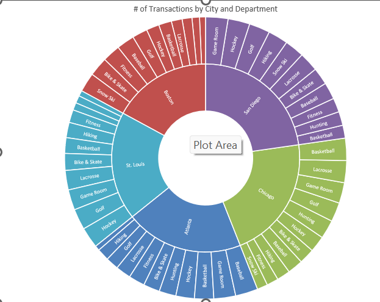

## Excel Data Analysis – Blue Lake Sports

### Overview
This project analyzes transaction and tax data for a sporting goods company using Microsoft Excel.  
The goal was to transform raw data into meaningful insights through data cleaning, analysis, and structured financial calculations.

## Project Visuals
### Sunbars Chart

### Data table

### Analysis (Fees)

### Key Tasks

- Imported raw data from a text file into Excel  
- Cleaned and structured the dataset into a usable table  
- Sorted and filtered data to focus on key categories  
- Built a PivotTable to analyze transactions by department  
- Created a PivotChart to visualize transaction distribution  
- Designed a Sunburst chart to represent hierarchical relationships (City → Department)  
- Performed tax calculations using XLOOKUP and structured lookup tables  
- Built formulas using order of operations to calculate total sales with tax  
- Applied SUMPRODUCT and range-based calculations  
- Created summary calculations across multiple cities and product categories  
- Applied financial formatting (Accounting format) for reporting  
- Developed a structured report for transaction and tax analysis  

### Key Insights

- Game Room and Running departments show high transaction volume  
- Transaction distribution varies significantly across cities  
- Certain product categories dominate within specific regions  
- Tax rates impact total revenue differently across locations  

### Skills Used

- Data Cleaning  
- Data Analysis  
- PivotTables & PivotCharts  
- Data Visualization  
- Excel Formulas (XLOOKUP, SUMPRODUCT, logical calculations)  
- Financial & Tax Calculations  
- Data Reporting  

### Tools

- Microsoft Excel  

